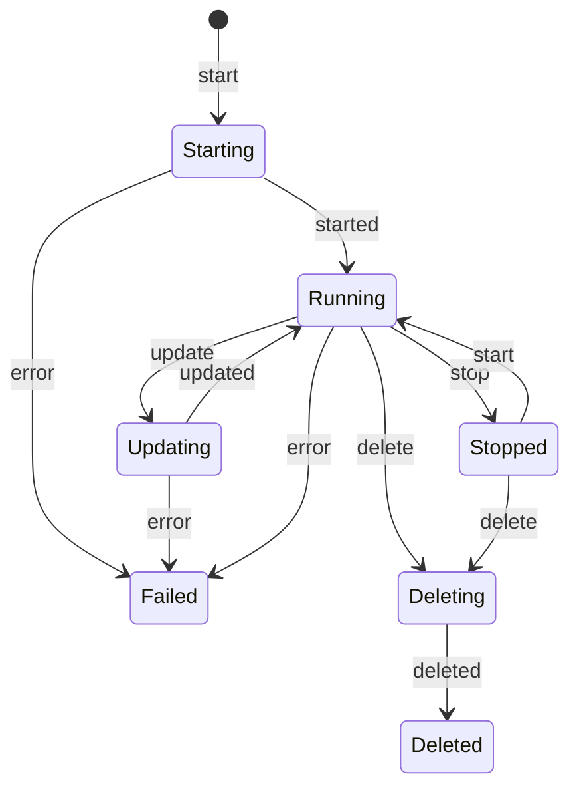

# gRPC API
[](https://github.com/marketplace/actions/super-linter)

All protobuf definitions for interacting with blockvisor-api.

## API v1

### Node States



## Compilation

### TypeScript

Run this for the initial setup:
```bash
npm install protobufjs long nice-grpc-common grpc-tools ts-proto
mkdir generated
```

Then each time you want to get new ts files from the changed protos run:
```bash
./node_modules/.bin/grpc_tools_node_protoc \
    --plugin=protoc-gen-ts_proto=./node_modules/.bin/protoc-gen-ts_proto \
    --ts_proto_out=./generated \
    --ts_proto_opt=env=browser,outputServices=nice-grpc,outputServices=generic-definitions,outputJsonMethods=false,useExactTypes=false,esModuleInterop=true \
    --proto_path=./ \
    ./v1/*
```

